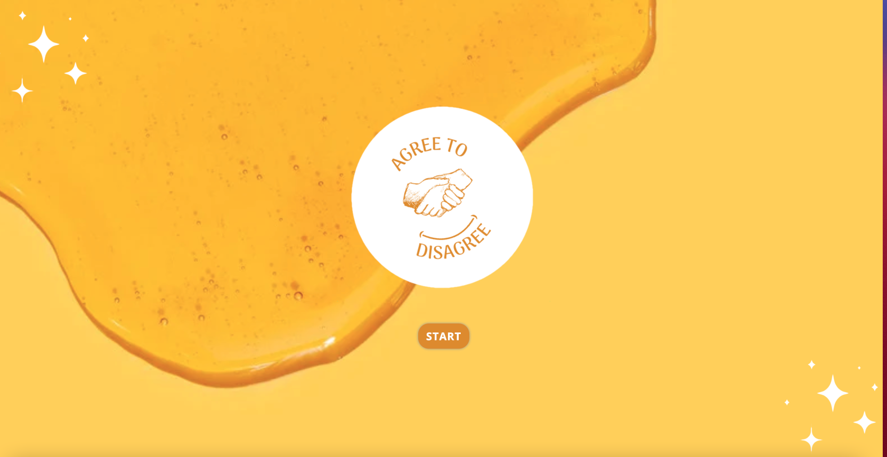
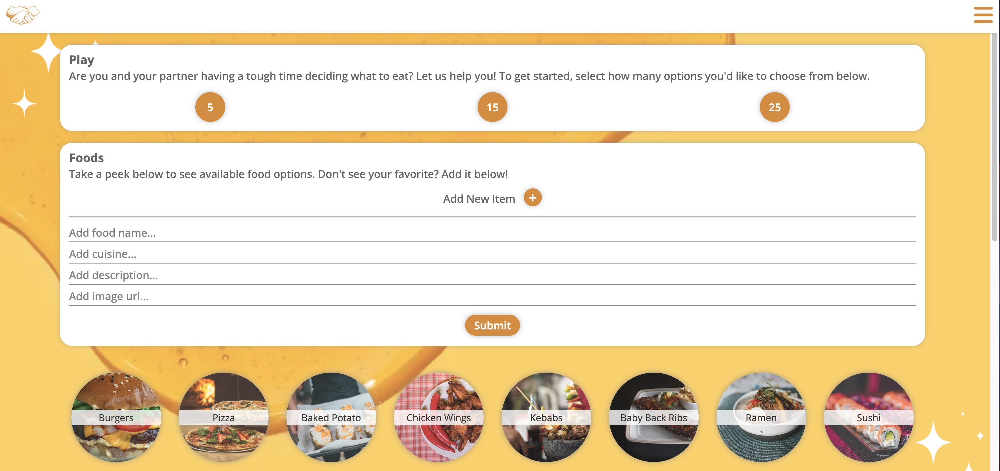
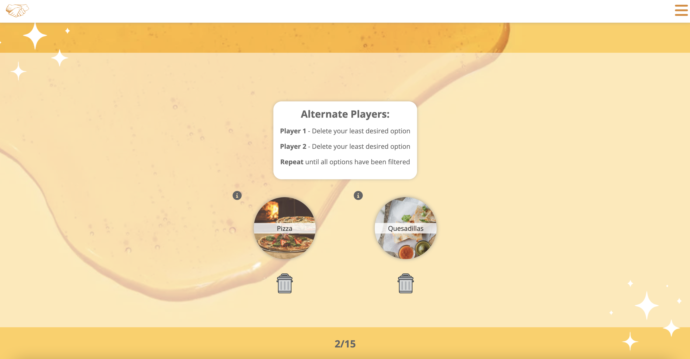
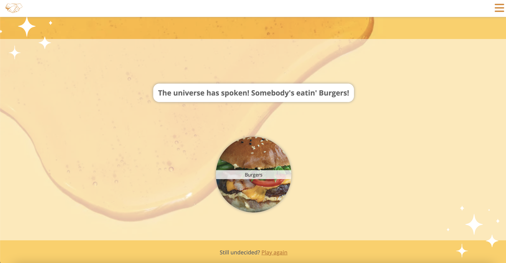

## Description:
This is a Tinder-style inspired application for helping users make a decision on what they should eat. 

## Deployed Application Link:

https://agree-to-disagree.netlify.app/

## User Stories:

As a user I would like to have these features:
• Be able to see the instructions on how to play the game.

• Be able to explore different food cuisines in a list I can choose from.

• Be able to discard cuisines that I don't want to eat easily.

• Be able to compare choices with my partner.

• Be able to use all of the features either on desktop or mobile.

## Screenshots:

## Technologies Used:
 
 This application was built with:

 1.  ReactJS - A JavaScript library for building user interfaces

 2.  MongoDB -  A non-relational document database that provides support for JSON-like storage

## Getting Started/Installation Instructions:
npm install Installs required dependencies.

npm start Starts the development server.

npm run build Bundles the app into static files for production.

npm test Starts the test runner.

npm run eject Removes this tool and copies build dependencies, configuration files and scripts into the app directory. If you do this, you can’t go back!